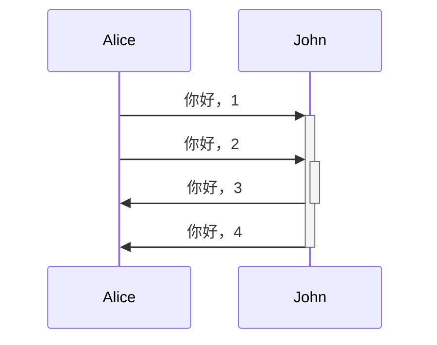
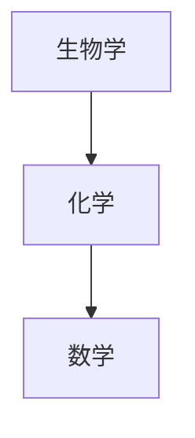
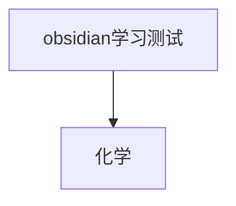

# 提升你的思维
Obsidian 是一款**注重隐私**、**灵活性高**的笔记应用，能让你根据自己的思维方式记录笔记和写作。

## （一）标签 
- 标签可支持嵌套标签，在标签名中添加斜杠（/）即可创建嵌套标签。
- 标签必须至少包含一个非数字字符。
- 标签不分大小写，不能含空格。
- 标签中可使用以下字符：字母、数字、_、-、/
- #清理箱/待阅读

# （二）标注
>[!info] 标注标题可以有自定义标题
>这是一个标注块
>其中info是类型标识符，类型标识符决定了标注的外观。
>它支持**MarkDown**、内部链接 和 嵌入！

>[!tip]- 折叠标注
>通过在类型标识符后添加+或-来使标注可折叠

>[!question] 标注可嵌套
>>[!todo] 嵌套1
>>>[!example] 嵌套2
>>>

还可自定义标注（我还没学习这部分拓展）

>[!note]

>[!abstract]

>[!success]

>[!warning]

>[!failure]

>[!danger]

>[!bug]

>[!Quote]

## （三）多光标模式
	   允许同时使用多个光标编辑文本，通过按住Alt并在笔记中点击另一个位置来添加额外的光标。

## （四）段落
- 要创建段落，用空行分隔。
- 段落内部的多个空格和段落之间的多个空行在阅读视图中会被合并显示为一个空格和一个空行。
- 若想要显示多个空格或空行，可以使用&nbsp;(空格) 和\<br\>(换行)

## (五) 小标题
		要创建小标题，在小标题文本前添加至多六个 # 符号。# 符号的数量决定了小标题的级别。

## （六）粗体、斜体、高亮
粗体：**粗体文本**；
斜体：*斜体方式一*；_斜体方式二_；
删除线：~~删除线文本~~；
高亮：==高亮文本==；
粗体和嵌套斜体：**粗体和*嵌套斜体*文本**；
粗体和斜体：***粗体和斜体文本***；
>若需要语法符号视为普通文本进行展示，需要在语法符号前加反斜杠进行转义。

## （七）内部链接
**OBSidian支持两种语法：**
- Wiki式链接：[[obsidian学习测试]]
- MarkDown式链接：[obsidian学习测试](obsidian学习测试.md)
**链接附件**：
- 输入\[\[,然后选择要链接到的附件。
- 选择编译器中的文本，然后按下\[\[，随后选中的文本将自动转变为链接。
- 打开命令面板，然后选择插入链接命令。
**链接笔记小标题（锚链接）**：
可单个链接，也可逐级链接。
[[obsidian学习测试#三级#四级#五级]]
**自定义锚文本**：
对于wiki格式：使用（|）[[obsidian学习测试 | 链接测试文档]]
对于markdown格式：[链接测试文档](obsidian学习测试.md)
**预览链接**：
按住Ctrl并将光标悬停在链接上即可。

## （八）外部链接
若要链接到外部URL，可通过在【】中填入描述链接的文本，然后在（）添加URL来创建内部链接。
[百度外部链接测试](http://baidu.com)

## （九）在链接中转义空格
		若URL包含空格，必须用%20替换。也可以用<>包裹URL进行转义。

## （十）外部图片
- 可通过在外部链接前加上！符号来在笔记中插入外部图片。
- \!\[替代文本\]\(外部图片链接\)
- 还可通过在链接的锚文本中添加 （|宽×高） 来更改图片尺寸。若只指定了一个，图片会根据原始长度进行缩放。
- \!\[替代文本 \| 宽\*高\]\(外部图片链接\)

## （十一）引用
>[!tip] 可在引用第一行加【！info】变成标注
>这是带有竖线的一段语言。
## （十二）列表
		可以在文本前加上\-、\*、\+来创建无序列表。
创建有序列表，每行以数字加上.开头。
## （十三）任务列表
		要创建任务列表，每个列表项以连字符和空格开头，后跟[];
- [ ] 这是未完成的任务
- [x] 这是已完成的任务
## （十四）嵌套列表
		要创建嵌套列表，请缩进一个或多个列表项。
1. 第一条
	1. 有序嵌套列表项
2. 第二条
	- 无序嵌套列表项
## （十五）水平线
		可以在单独的一行上使用三个或更多星号、短横线或下划线来添加水平线。这些分隔符号里允许有空格。

---
***
____
## （十六）代码
    可以在段落里插入代码，或将其放在代码块中。
## （十七）行内代码
- 可以使用一对反引号在句子插入代码。
- `反引号`中的文本将被格式化为代码。
## （十八）代码块
要创建一个代码块，用三个反引号括住代码。也可通过使用Tab键或四个空格缩进文本来创建代码块。
```(加代码语言高亮 java)
cd ~/Desktop
```
## （十九）脚注
这是一个简单的脚注[^1]。(和解释之间必须空行)
你也可以使用内联脚注。^[这是一个内联脚注]

[^1]: 这是脚注的说明
## （二十）注释
可以用%%注释%%包围文本来添加注释。注释只在编辑视图中可见。
## （高级二十一）表格
	    使用竖线（|）和短横线（-）来创建表格。竖线用于分隔列，短横线用于定义列标题。
	    表格两侧的竖线是可选的。单元格不需要与列完全对齐。每个标题行至少要有两个短横线。
| 名字 | 姓氏 |
| ---- | ---- |
| 文豪 | 熊 |
通过在标题行中添加冒号：，可以将文本左对齐、居中或者右对齐。

| 左对齐文本 | 居中对齐文本 | 右对齐文本 |
| :---- | :----: | ----: |
| 内容    |   内容   |    内容 |

## （高级二十二）图表
要添加Mermaid图表，创建一个mermaid代码块。



## （高级二十三）在图表中添加链接
可以通过将节点声明为internal-link类型在图表中创建内部链接。

若图表中有很多节点：

>[!note] 注意
>若笔记名称中包含特殊字符，需要将笔记名称放在双引号中。
>class "⨳ 特殊字符" internal-link
>或者A["⨳ 特殊字符"]
## （高级二十四）数学公式
可以使用MathJax和LateX符号在笔记中添加数学公式。要在笔记中添加MathJax公式，请用双美元符号（\$$）将其括起来
$$
\begin{vmatrix}a & b\\
c & d
\end{vmatrix}=ad-bc
$$
- [为MathJax基础教程](https://docs.mathjax.org/en/latest/basic/mathematics.html)
- [LateX扩展列表](https://docs.mathjax.org/en/latest/input/tex/extensions/index.html)